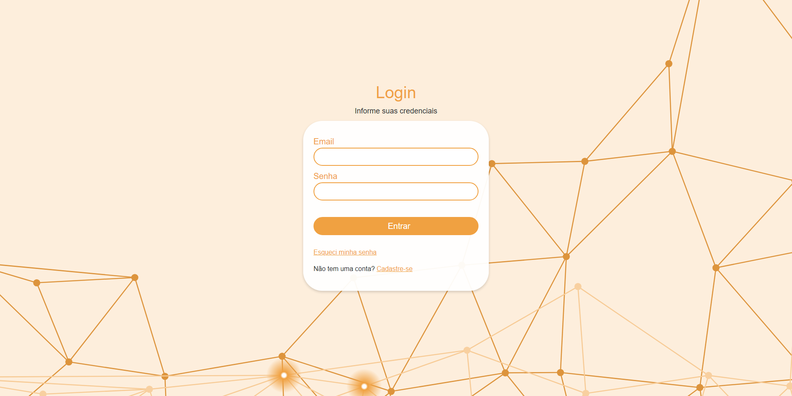

# Login - React Web Frontend

# 📔 About
Application for login, with possible add users and password recuperation.

# 💻 Is it running?
You can check it out up and running at Netlify by clicking here.

# 👀 Where can I find the web frontend and the mobile app?
You can check the repositories here:

NodeJs API Repository

# 🚀 Technologies in the API:
- Typescript
- React
- Bootstrap
- Axios
- Router-dom

# 📖 DEV Diary:
- With the depreciation of the getRepository method by TypeORM, I adapted the server to accept the new way of adapting to the database through the AppDataSource.
- Use of the Ethereal Email online tool to test sending emails in development environments.

# The author
Made with ❤️ by Ana Karla Santana. 🇧🇷

Get in touch! 😃

 
